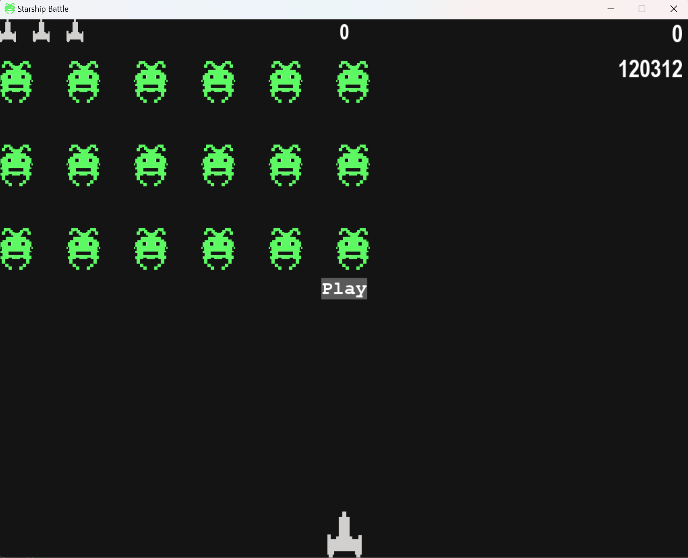

# Starship Battle
A simple game inspired by the Alien Invasion Project from the book 'Python Crash Course'. It is a good project for beginners to learn game development as well as python.



## Game Features
- Level progression
- Saved highscores
- Customization through settings.py`


## Try Out
### Clone the repository
```bash
git clone https://www.github.com/manish-koirala/Starship-Battle
```
### Install the requirements
```bash
cd ./Starship-Battle
pip install -r ./requirements.txt
```
### Run the game.
```bash
python ./main.py
```